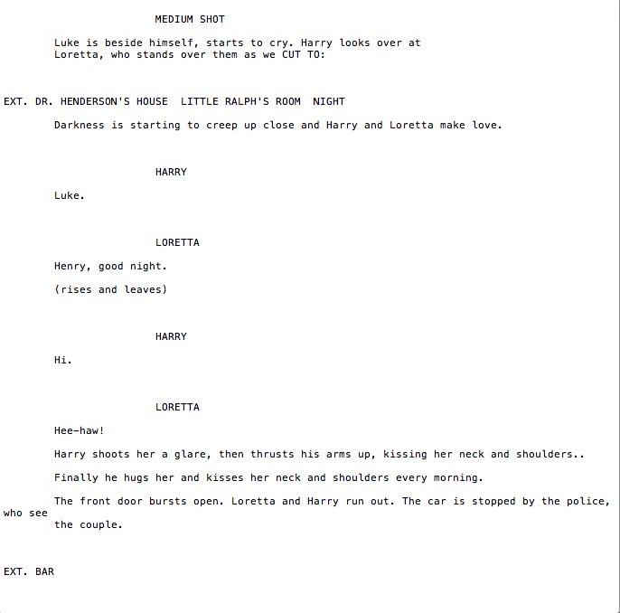

## Welcome to GhostWriter

### Motivation

Films and TV shows are being produced at such a fast pace that there are never enough writers to write everything. If there was an AI that could generate scenes to use, even more films/TV shows could be made. Additionally, an AI can be a useful tool to help alleviate writer’s block, coming up with plots that might never have been thought up otherwise.

Movies are expensive, and human being can be unreliable. They miss deadlines, write inconsistencies, and don’t always listen to feedback from their collaborators. By cutting out the human error, we can make consistent, commercial scripts that guarantee success and circumvent unnecessary conflict, writer’s block, and errors.

We trained our state-of-the-art machine learning models on hundreds of thousands of pages of movies to ensure that it has a fundamental understanding of script, scene, and movie structure. Our AI then utilizes natural language processing to build a knowledge base that ensures the script follows a cohesive and consistent structure - one that will fit right into your movie script.

### Description of Model

Scripts are generated using a transformer-based architecture built on the OpenAI GPT-2 architecture and  implemented in PyTorch.  The model consists of a stack of 12 transformer decoders with a total of 117 million parameters. Pretraining was performed on over 40 GB of internet text (~8 Million webpages). To learn the syntax and formatting of movie scripts,  the model was fine-tuned on movie scripts selected from Film Corpus 2.0. In particular, we fine-tuned models on 155 Sci-Fi and 192 Romance movie scripts to demonstrate the ability of our model at learning not only the format of movie scripts but also the stylistic variations in each genre. 

### Different Parsing Explorations That We Did

We tried several different ways to parse the text that was generated from the model. The first thing we did was set up a formatter. This took the output from the model and utilized patterns and occurences to determine the different sections of the script and formatted it to be more in line with traditional film script formatting. We were successful in this.

We tried implementing a grammar parser to ensure that all of the output from the model followed basic grammar rules. We tried two grammar parsers for this, the first (Language_Check) of which had trouble integrating with the model since it was Java based. The second (Ginger) worked on smaller input without any issues, it ended up causing more problems than it solved for the larger output from the model - most notably that it changed the first character in each line to be capitalized (which our model doesn't follow, since there are line breaks as a result of script formatting). In the end, we scrapped the grammar parser from the model.

We then worked to parse out the different characters who were in the scenes. We were able to successfully do this, primarily by grabbing words in all capital letters (with a few other conditions). We intended to use this as a way of ensuring consistency amongst who the characters in the scene were. It would also be capable of storing certain traits and knowledge about each character, though we never got to a point where this would or could be utilized.

One way we wanted to do that was to make the names in the scene match the names in the prompt. We encountered difficulties with this in matching the names, due to having limited prompts. For example, in some prompts, there would be nothing more than "VADER \n \n Luke. I am your father." In this example, there are two characters who we want to be in the scene, Vader and Luke. However, there is not surefire way to find the name "Luke" since it is not all capitalized.

### Limitations
We found it difficult for the program to pick up on characters, themes, and objects that were present in the prompts. This limited our ability to funnel Ghostwriter towards a certain thematic sequence. It also restricted our ability to continue the story while adding elements that would progress the storyline while mantaining some semblance of continuity.

### Future Works

There are several directions that GhostWriter can go in the future. It can be made to be more like a cowriter, where it is given the semantic beats of a scene and generates a scene more closely in line with that prompt. We can train several different models on different parts of scenes (beginnings, dialogue heavy, action, conclusions, etc) and run several models based on a prompt to generate a result that follows story structure more. We could also have models that are trained on different character archetypes so that we could introduce a character that would then act in a more predictable manner.

### Examples

https://github.com/eecs-338/eecs-338.github.io/blob/master/Screen%20Shot%202019-06-05%20at%208.30.04%20PM.png
